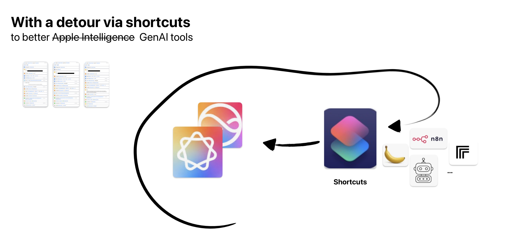

# GenAI Shortcuts: One-Tap Image & Video Magic

*A detour via shortcuts to better Apple Intelligence GenAI tools*

Transform photos into videos or edit them with AI all with just one tap from your iOS share menu. These Apple Shortcuts harness the power of Google's cutting-edge **Nano-Banana** (Gemini 2.5 Flash Image) and **Seed Dance Pro** models via Replicate's API to bring professional AI editing directly to your iPhone.

## What This Does

Instead of juggling between apps or web interfaces, these shortcuts integrate seamlessly into your iPhone's native workflow. Select any photo, hit share, choose your AI workflow, and watch the magic happen — results automatically save to your Photos library.

<table>
  <tr>
    <td>
      <strong>Bananas</strong> 
      Edit photos with sketches, annotations, or prompts.
      <ul>
        <li>Understands arrows, circles, and text notes</li>
        <li>Natural-language prompt support</li>
        <li>Great for creative edits and quick mockups</li>
      </ul>
    </td>
    <td></td>
  </tr>
  <tr>
    <td>
      <strong>Banana-del_</strong> 
      Delete highlighted/annotated objects. Gaps are smartly inpainted.
      <ul>
        <li>Mark unwanted objects with iOS markup tools</li>
        <li>One tap removal with realistic background fill</li>
        <li>Perfect for cleanups and distractions</li>
      </ul>
    </td>
    <td></td>
  </tr>
  <tr>
    <td>
      <strong>Moving Memories</strong> 
      Restore an old photo, then generate a realistic 5s motion clip.
      <ul>
        <li>Step 1: photo restoration and enhancement</li>
        <li>Step 2: predictive motion video (about 5s)</li>
        <li>Ideal for vintage family photos</li>
      </ul>
    </td>
    <td></td>
  </tr>
  <tr>
    <td>
      <strong>Make It Move</strong> 
      Turn a still photo into a short dynamic video.
      <ul>
        <li>Natural camera and subject motion</li>
        <li>About 5 seconds per clip</li>
        <li>Great for social posts and fun reveals</li>
      </ul>
    </td>
    <td></td>
  </tr>
  <!-- Different source GIF sizes are harmonized via consistent width -->
  <!-- Add more rows anytime; the layout will remain balanced. -->
  
</table>

## Quick Start

### Prerequisites
- iOS 18+ (iOS 26+ for full LLM integration features)
- [Replicate API key](https://replicate.com) (pay-per-use pricing)

### Installation
1. Download the `.shortcut` files from the `shortcut_files/` directory
2. Open each file on your iOS device to install
3. When prompted, add your Replicate API key
4. Grant photo library access permissions

### Usage
1. Select any photo in your Photos app
2. Tap the share button
3. Choose your desired AI workflow:
   - **Bananas** - Image editing with annotations
   - **Banana-del_** - Remove highlighted objects (smart inpainting)
   - **Make It Move** - Still to video conversion  
   - **Moving Memories** - Photo restoration + video generation
4. Follow the prompts and wait for AI magic (
5. Results automatically save to your Photos library

## The Tech Behind the Magic

### Nano-Banana (Gemini 2.5 Flash Image)
Google's latest image generation model that excels at:
- Understanding sketches and annotations 
- Realistic photo editing and manipulation
- Fast generation (2.3 seconds for 1024x1024 images)
- Superior prompt adherence compared to DALL-E 3

### Apple Shortcuts + AI Integration
With iOS 18+ and the new Foundation Models framework:
- On-device LLM processing for prompt enhancement
- Seamless integration with Apple Intelligence
- Native photo library management
- Siri voice activation support

### Replicate Platform
- Access to cutting-edge AI models (thousands!)
- Pay-as-you-go pricing (typically $0.039 per image)
- Production-ready APIs with automatic scaling
- No infrastructure management required

## Use Cases & Ideas

### Personal
- **Family Archives**: Restore and animate old family photos
- **Social Media**: Create eye-catching content from still photos  
- **Creative Projects**: Edit photos with natural language descriptions
- **Memory Lane**: Watch vintage photos come alive with realistic motion

## The Bigger Picture

This project showcases how AI-powered workflows are becoming accessible to everyone. What used to require expensive software and technical expertise can now more and more be achieved with automations - soon very likely automatically generated user-specific workflows that will render more and more dedicated apps outdated.

The shortcuts framework is well integrated across all Apple devices and within the software system - might turn out that Apple Intelligence will be quite a success once "Siri" starts to generate and memorize workflows for its users.

## Technical Details

### Workflow Architecture
Each shortcut follows this pattern:
1. **Input**: Photo from share menu
2. **Processing**: Base64 encoding, API calls to Replicate
3. **Enhancement**: LLM-powered prompt optimization (iOS 26+)
4. **Output**: Automatic save to Photos library with metadata

### API Integration
- **Nano-Banana**: `replicate/nano-banana` model for image generation via Replicate
- **Video Models**: Seedance pro video generation model via Replicate
- **Rate Limiting**: Built-in error handling and retry logic
- **Cost Management**: Transparent usage tracking

## Getting Started

Ready to transform your photo editing workflow? 

1. **Get your Replicate API key**: [Sign up here](https://replicate.com)
2. **Download the shortcuts**: Check the `shortcut_files/` directory
3. **Install on iOS**: Open the files directly on your device
4. **Start creating**: Select a photo, share, and choose your AI workflow

*Note: These workflows use pay-per-use AI models from replicate.com. Costs are typically very low ($0.03-0.05 per generation) but can add up with heavy usage.*

---

**Tip**: For best results with Nano-Banana, try adding simple sketches or annotations to guide the AI. The model excels at understanding visual cues and natural language descriptions combined.
